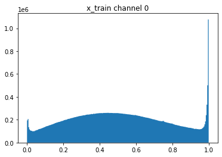
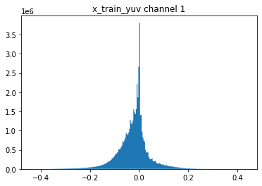
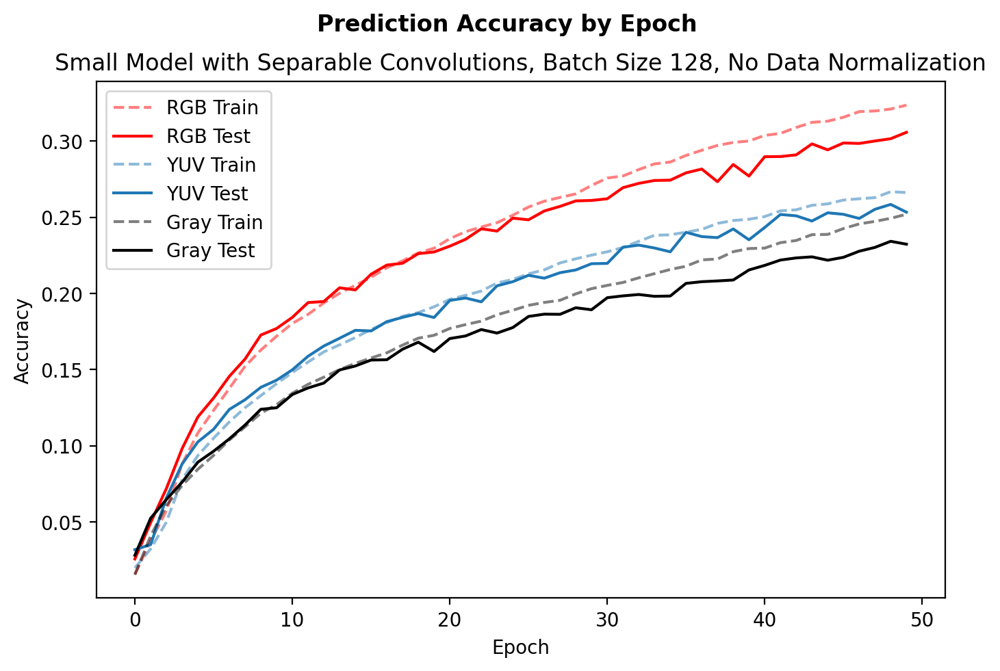

# Experimental Log for Color Spaces Experiment

### Some old notes that I found:
Current state of the YUV model:

- Something is funky with the intensity scaling.
	- In theory, YUV channels should be:
		Y: 0 - 1
		U: -0.5 - 0.5 
		V: -0.5 - 0.5
	- It seems that my y predictions are mostly in the 0 to 1 range, but also have a number of values below 0
	- U and V outputs are mostly within range

- When converting from YUV to RGB, and then clipping the values between 0 and 1 results in good looking outputs

- I have doubts that I trained on the sketch data. Need to double check that sketches made it in vs. just the canny edges
	- I checked, and it looks good

### August 3, 2020

Last time I was working on this experiment, I noticed that each colorspace had a different distribution of values. For example, here's a histogram of inensities in one channel fo the RGB input (all channels look similar to this).

That is in contrast to the intensities seen in the U and V channels of the YUV transformed dataset, as shown here.

Based on earlier results, I assumed that it would be a more comparable experiment if I at least had the inputs normalized from [0-1] such that they lie in the same input space.

I trained three networks of the same architecture on RGB, YUV, and three-channel gray inputs.

**Network architecture:** `32c3-relu-mp2-64c3-relu-64c3-64n-relu-64n-relu-100n-softmax`

**Hyperperameters:** 128 batch size (for faster training), 256 epochs, 0.00002 learning rate

It confuses me to see that YUV performance is so poor. I also believe that normalizing the inputs from [0,1] made it worse.

---

As I wrote up the hyperparmeters, it occured to me that a learning rate of 0.00002 is at least 10x slower than what most recommend for a naive Adam LR. Trying with 0.0003, I see that the model quickly overfits. Test accuracy at epoch 50 is higher than at 256 previously. Might make experimental iteration quicker to run fewer epochs at a higher LR.

Here's what the experiment looks like with the higher learning rate and fewer epochs. Same overall outcome.

---

When running the experiment with no normalization, the performance of the YUV net significantly improves to the point where it is nearly comparable with RGB.

**Conclusions from the day:**

- Normalizing from 0 to 1 across the entire dataset significantly hurts performance of the YUV net.
- Increasing learning rate reduces iteration time, though does result in overfitting beyond epoch 50.

**Open Questions:**

- Are all of these experiments moot given that performance in an absolute sense isn't great (e.g. 35% accuracy), and that the model has a strong tendency to overfit?
- Given that convolutions combine the channels past the first layer, is any color information lost too quickly? Would it be more optimal to try this with something like separable convolutions?

**Next Experiments to Try:**

- Separable convolutions
- What happens to classification accuracy on any modle if you start messing with the channels. For example, does it matter if you switch the order of the RGB channels, or is the model just flattening them in the first step.

### August 4, 2020

I tried seperable convolutions. Similar outcome, except performance is worse.

